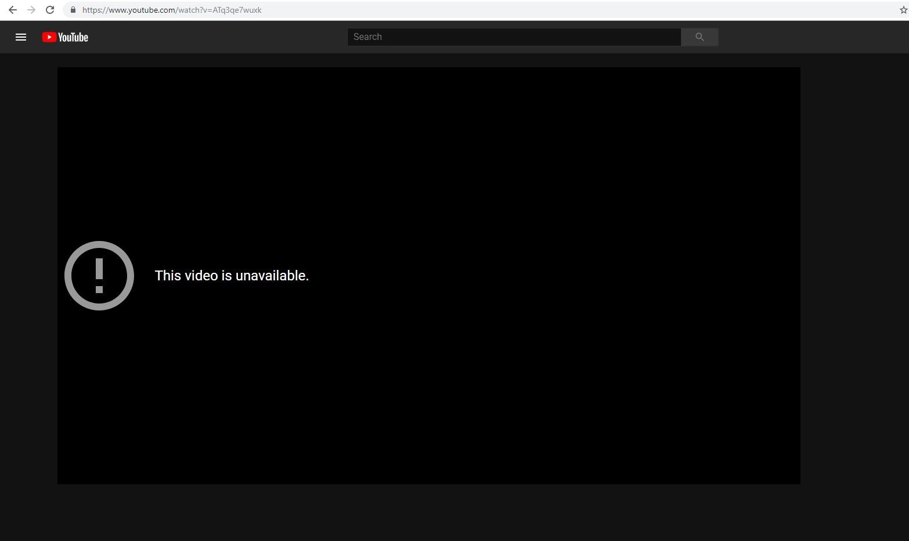
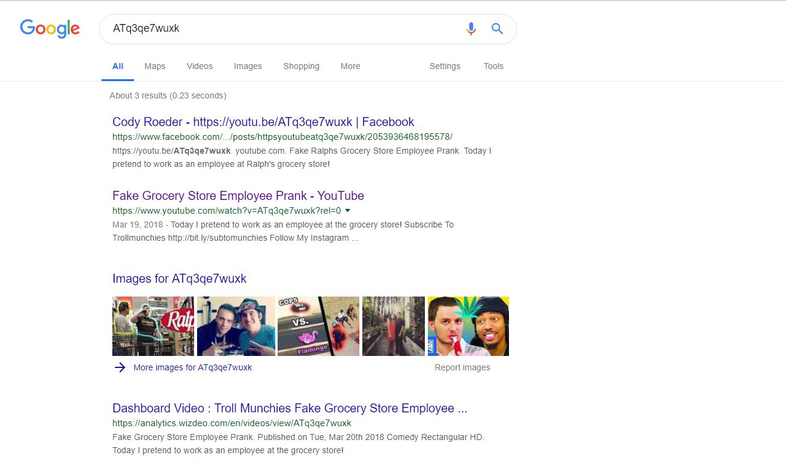
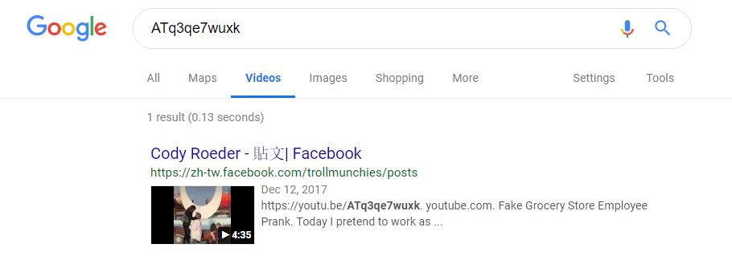

# YoutubeGraveyard
Use several methods to find what a youtube video was before it was removed from the site and possibly find archived versions.

Current version: download html and js files to modify

Scan Google for video title and related links using video url:

